# Fancy Calculator

Завдання початкового рівня для практики навички налагодження юніт тестів у Visual Studio. Переклади: [Англійська](README.md).


## SonarLint

Рекомендуємо встановити [розширення SonarLint для Visual Studio](https://www.sonarlint.org/visualstudio). Це розширення дуже корисне під час розробки, тому що воно виявляє "на льоту" проблеми якості та безпеки коду та виділяє їх у редакторі коду Visual Studio.

Коли розширення "SonarLint" встановиться знову запустіть програму. Зараз Visual Studio вказуватиме на проблеми, виявлені Sonar у вікні редактора коду, наголошуючи на проблемних місцях хвилястою лінією.

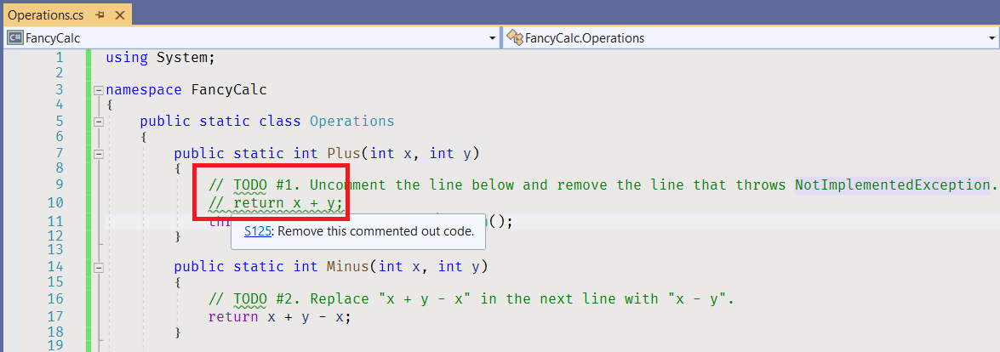


## Завершіть завдання

1. [Зберіть проєкт](https://docs.microsoft.com/en-us/visualstudio/ide/building-and-cleaning-projects-and-solutions-in-visual-studio).
     * Виберіть елемент меню - _Build\Build Solution_.
     * Або використовуйте клавіші - _Ctrl+Shift+B_.


2. Відкрийте [Test Explorer](https://docs.microsoft.com/ru-ua/visualstudio/test/run-unit-tests-with-test-explorer).
     * Виберіть елемент меню - _View\Test Explorer_.
     * Або використовуйте сполучення клавіш - _Ctrl+E, T_.

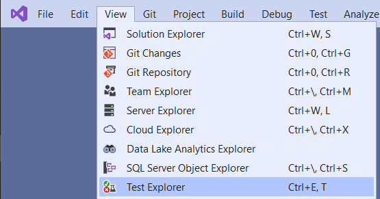

3. Запустіть усі юніт-тести. Проєкт містить 20 юніт тестів, як мінімум 15 юніт тестів у Test Explorer мають бути "червоними".
     * Виберіть елемент меню - _Test\Run All Tests_.
     * Або використовуйте сполучення клавіш - _Ctrl+R, A_.

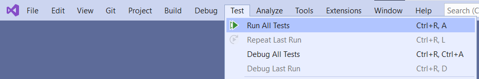

4. Подвійний клік на юніт-тесті "Plus_WithOneAndOne_ReturnsTwo". Visual Studio відкриє вікно редактора коду для [OperationsTests.cs](FancyCalc.Tests/OperationsTests.cs) і перенаправить вас до коду юніт-тесту.


5. Перейдіть до коду "Operations.Plus" методу.
     * Натисніть правою кнопкою миші на ім'я методу "Plus" на 13 рядку та натисніть на елементі меню "Go to Definition".
     * Або клацніть на імені методу "Plus" на 13 рядку і використовуйте сполучення клавіш _F12_.
     * Або клацніть на імені методу "Plus" на 13 рядку, затиснувши клавішу _Ctrl_.


6. Visual Studio відкриє вікно редактора коду для [Operations.cs](FancyCalc/Operations.cs) файлу та перенаправить вас до коду методу.
1. Перейдіть до рядка 10.
     * Використовуйте клавіші курсору.
     * Або використовуйте сполучення клавіш - _Ctrl+G_, натисніть 10 та клавішу _Enter_.


8. Розкоментуйте поточний рядок.
     * Використовуйте клавіші - _Ctrl+K, Ctrl+U_.

```cs
public static int Plus(int x, int y)
{
     // TODO #1. Розкоментуйте рядок нижче та видаліть рядок, який викидає throws NotImplementedException.
     return x + y;
     throw new NotImplementedException();
}
````

9. Перейдіть на наступний рядок – рядок 11.
10. Закоментуйте поточний рядок.
     * Використовуйте клавіші - _Ctrl+K, Ctrl+C_.

```cs
public static int Plus(int x, int y)
{
     // TODO #1. Розкоментуйте лінію нижче та видаліть рядок, який викидає NotImplementedException.
     return x + y;
     //throw new NotImplementedException();
}
````

11. Відкрийте вкладку Test Explorer, запустіть усі юніт-тести. Всі "Plus" юніт-тести та "Plus_WithOneAndOne_ReturnsTwo" юніт-тести зараз "зелені".

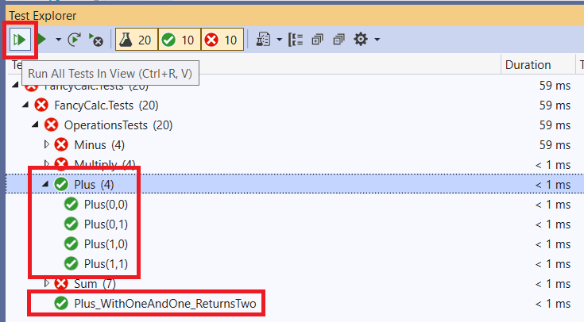

12. Перегляньте "Minus" юніт-тести у списку тестів. Тільки один юніт-тест "зелений", інші – "червоні".


13. Перейдіть до коду юніт-тесту, а потім перейдіть до коду методу Minus у файлі [Operations.cs](FancyCalc/Operations.cs).


14. Виправте код методу "Minus" відповідно до TODO коментарів.

```cs
public static int Minus(int x, int y)
{
     // TODO #2. Замініть "x + y - x" на наступному рядку на наступний "x - y".
     return x - y;
}
````

15. Відкрийте вкладку Test Explorer, клацніть на рядку "Minus (4)" і запустіть всі юніт-тести "Minus", використовуючи пункт меню при натисканні правої кнопки миші. Юніт тести "Minus" мають бути зеленими.


16. Перейдіть до юніт-тесту "Multiply", а потім до коду методу "Multiply" у файлі [Operations.cs](FancyCalc/Operations.cs).


17. Додайте точку зупинки на рядку 23.
     * Клацніть на вертикальній смузі ліворуч від рядка 23.
     * Або використовуйте клавішу - _F9_.


18. Перейдіть на вкладку Test Explorer і запустіть "зелений" юніт-тест "Multiply(0, 0)" у режимі налагодження.
     * Клацніть правою кнопкою миші на юніт-тесті "Multiply" та виберіть елемент меню "Debug".
     * Або використовуйте сполучення клавіш - _Ctrl+R, T_.

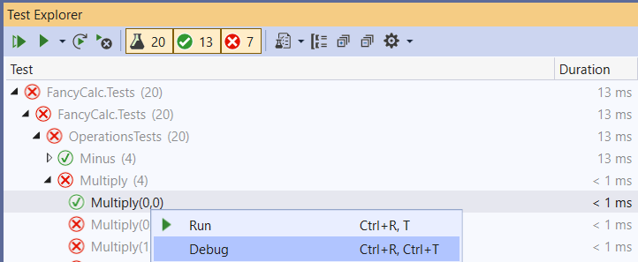

19. Відстежте виконання програми.
     * Клацніть на елементі меню "Debug\Step Over".
     * Або використовуйте клавішу - _F10_.
     * Або використовуйте відповідний пункт меню вкладки "Debug" на панелі меню.

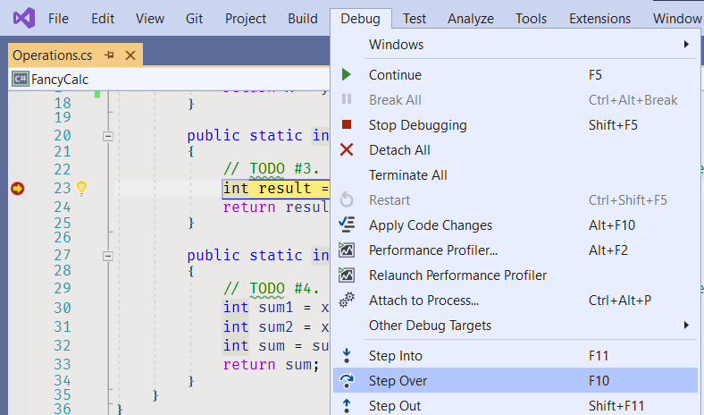

20. Вивчіть змінну "result".
     * Наведіть курсор миші на змінну "result" на рядку 24.


21. Зупиніть налагодження.
     * Клацніть на елементі меню "Debug\Stop Debugging".
     * Або використовуйте клавішу - _Shift+F5_.


22. Видаліть точку зупинки на рядку 23 і додайте точку зупинки на рядку 24.


23. Виконайте "червоний" юніт-тест "Multiply(0, 1)" знову в режимі налагодження.


24. Вивчіть змінну "result".

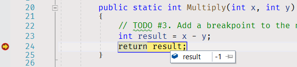

25. Продовжуйте виконання програми.
     * Клацніть на пункті меню "Debug\Continue".
     * Або використовуйте клавішу - _F5_.
     * Або використовуйте відповідний пункт меню вкладки "Debug" на панелі меню.


26. Виправте код методу "Multiply".

```cs
public static int Multiply(int x, int y)
{
     // TODO #3. Додайте точку зупинки на наступний рядок, запустіть юніт-тест у режимі налагодження та вивчіть змінну result під час виконання.
     int result = x * y;
     return result;
}
````

27. Відкрийте вкладку Test Explorer і знову запустіть всі юніт-тести "Multiply". Наразі юніт-тести "Multiply" мають бути "зеленими".


28. Відкрийте вкладку Test Explorer і запустіть усі юніт-тести "Sum". Деякі юніт-тести мають бути "червоними".


29. Додайте точку зупинки на рядку 30.


30. Запустіть один із провалених юніт-тестів у режимі налагодження.


31. Простежте виконання програми, щоб знайти проблему.
32. Виправте код.

```cs
public static int Sum(int x1, int x2, int x3)
{
     // TODO #4. Додайте точку зупинки на наступний рядок, запустіть юніт-тест у режимі налагодження та вивчіть виконання програми.
     int sum1 = x1 + x2;
     int sum = sum1 + x3;
     return sum;
}
````

33. Відкрийте вкладку Test Explorer і запустіть усі юніт-тести "Sum". Зараз юніт-тести "Sum" мають бути "зеленими".

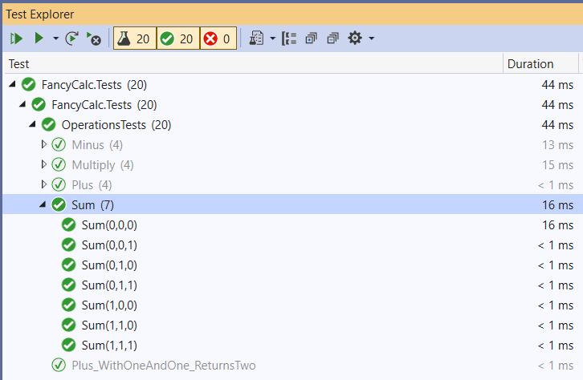

34. Запустіть всі юніт-тести і переконайтеся, що вони всі "зелені".


35. Перекомпілюйте рішення.
     * Натисніть на пункт меню - _Build\Rebuild Solution_.


36. Відкрийте панель "Error List". Панель містить кілька попереджень. Три попередження належать до рядка 11.
     * Натисніть на пункт меню "View\Error List".
     * Або використовуйте сполучення клавіш - _Ctrl+W, E_.

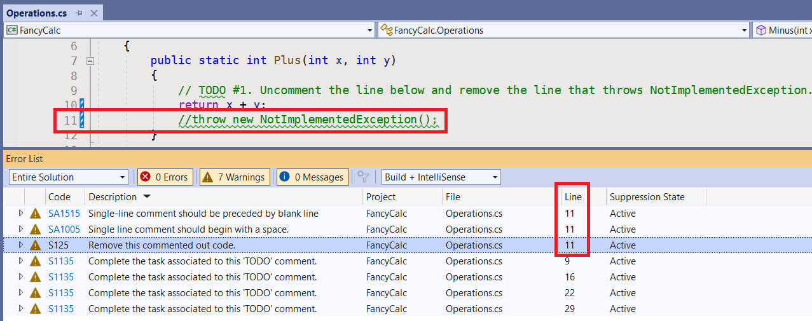

37. Видаліть рядок 11.

```cs
public static int Plus(int x, int y)
{
     // TODO #1. Розкоментуйте рядок нижче та видаліть рядок, який викидає NotImplementedException.
     return x + y;
}
````

Якщо ви залишите цей коментар у вашому коді, Sonar викличе проблеми, коли ви запустите перевірку завдання в AutoCode.


38. Перекомпілюйте рішення і знову відкрийте панель "Eror List". Наразі панель не має попереджень.

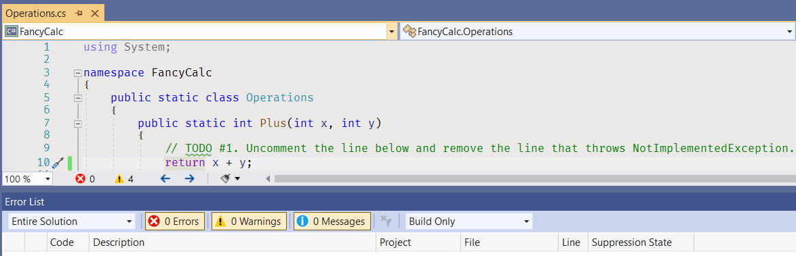

39. Якщо у Visual Studio встановлено розширення, Visual Studio підкреслить хвилястою лінією слово "TODO" у вікні редактора. Це попередження згенеровано [правилом S1135] (https://rules.sonarsource.com/csharp/RSPEC-1135).


Опис правила вказує:

_TODO Теги зазвичай використовуються для позначення місць, де потрібно ще трохи коду, але який розробник хоче реалізувати пізніше. Іноді розробник не матиме часу або він просто забуде повернутися до цього тегу. Це правило призначене для відстеження цих тегів та забезпечення того, щоб вони не залишилися непоміченими.

40. Видаліть усі рядки коментарів зі словом "TODO", щоб усунути проблеми.

```cs
public static int Plus(int x, int y)
{
     return x + y;
}
````

Якщо ви залишите коментар TODO у вашому коді, Sonar викличе проблеми, коли ви запустите перевірку завдання в AutoCode.


## Виправте проблеми компілятора

Для проектів у цьому рішенні включені додаткові перевірки стилю та коду. Вони допоможуть Вам підтримувати узгодженість вихідного коду проекту та уникатидурних помилок. [Перегляньте список помилок](https://docs.microsoft.com/ru-ru/visualstudio/ide/find-and-fix-code-errors#review-the-error-list) у Visual Studio, щоб побачити всі попередження та помилки компілятора.

Якщо текст помилки або попередження компілятора Вам не зрозумілий, перегляньте детальну інформацію про помилку (https://docs.microsoft.com/ru-ru/visualstudio/ide/find-and-fix-code-errors#review-errors- in-detail) або введіть у пошуку google код помилки або попередження, щоб отримати більше інформації про проблему.

Також, ви можете використовувати [Базу знань правил Sonar](https://rules.sonarsource.com/csharp) для пошуку більш детальної інформації щодо виявлених попереджень Sonar.


## Проблеми Sonar

Якщо ви залишите рядок із коментарем "TODO" або будь-які закоментовані рядки коду, у вас виникнуть проблеми з Sonar під час перевірки завдання.

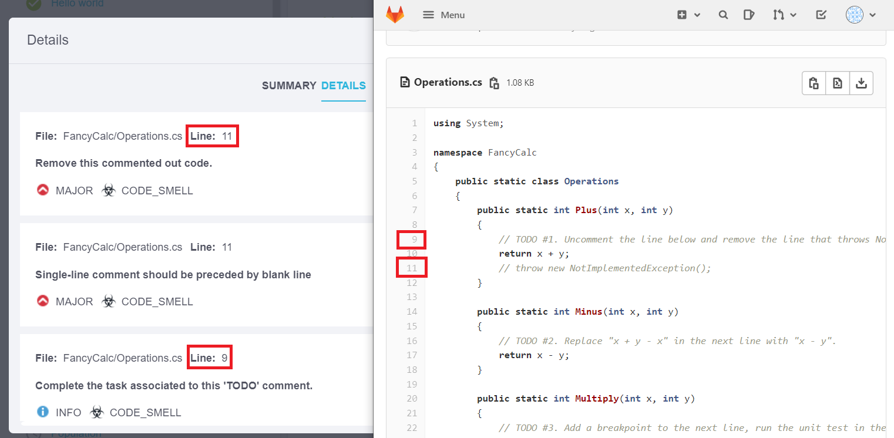

Щоб отримати більш високу оцінку, усуньте ці проблеми і знову запустіть перевірку завдання.


## Збережіть вашу роботу

* [Перезберіть рішення] у Visual Studio.
* Перевірте [вікно Error List](https://docs.microsoft.com/ru-ua/visualstudio/ide/reference/error-list-window) на помилки та попередження компілятора. Якщо у вас є якісь помилки та попередження, **виправте проблеми** і перекомпілюйте рішення знову.
* [Запустіть всі юніт-тести в Test Explorer](https://docs.microsoft.com/ru-ua/visualstudio/test/run-unit-tests-with-test-explorer) і переконайтеся, що **немає провалених юніт-тестів**. Виправте ваш код, щоб зробити всі юніт-тести ЗЕЛЕНИМИ (https://stackoverflow.com/questions/276813/what-is-red-green-testing).
* Перегляньте всі зміни **до** збереження вашої роботи.
     * Відкрийте вкладку "Changes" у [Team Explorer](https://docs.microsoft.com/ru-ru/visualstudio/ide/reference/team-explorer-reference).
     * Натисніть правою кнопкою миші на зміненому файлі.
     * Натисніть пункт меню "Compare with Unmodified", щоб відкрити вікно порівняння.
* [Підготуйте зміни](https://docs.microsoft.com/ru-ru/azure/devops/repos/git/commits#how-to-stage-your-changes) та [створіть коміт](https:// docs.microsoft.com/ru-ru/azure/devops/repos/git/commits#how-to-create-a-commit).
* Поділіться вашими змінами, відправивши їх на віддалений репозиторій (https://docs.microsoft.com/ru-ru/azure/devops/repos/git/pushing).


## Додаткова інформація

* Visual Studio
   * [Знайомство з відладчиком Visual Studio](https://docs.microsoft.com/ru-ru/visualstudio/debugger/debugger-feature-tour)
   * [Короткий посібник: Налагодження коду C# або Visual Basic за допомогою відладчика Visual Studio](https://docs.microsoft.com/ru-ru/visualstudio/debugger/quickstart-debug-with-managed)
   * [Підручник. Відомості про налагодження коду C# за допомогою Visual Studio](https://docs.microsoft.com/ru-ru/visualstudio/get-started/csharp/tutorial-debugger)
   * [Переходьте по коду за допомогою відладчика Visual Studio](https://docs.microsoft.com/ru-ru/visualstudio/debugger/navigating-through-code-with-the-debugger)
   * [Сполучення клавіш за замовчуванням у Visual Studio](https://docs.microsoft.com/ru-ua/visualstudio/ide/default-keyboard-shortcuts-in-visual-studio)