# Hello, world!

Завдання початкового рівня для відпрацювання навичок управління завданнями в AutoCode і запуску юніт тестів у Visual Studio.

Переклади: [Англійська](README.md).

Час виконання завдання - 1г.

Завдання потребує встановленого .NET 6 SDK.

## Опис завдання

У цьому завданні немає завдань на кодування, лише робота з Visual Studio.

1. Перейдіть на вкладку [Solution Explorer](https://docs.microsoft.com/ru-ua/visualstudio/ide/solutions-and-projects-in-visual-studio#solution-explorer).
     * Виберіть елемент меню - _View\Solution Explorer_.
     * Або використовуйте клавіші - _Ctrl+Alt+L_ (сполучення клавіш можуть відрізнятися в різних версіях Visual Studio. Див. статтю [Поєднання клавіш у Visual Studio](https://docs.microsoft.com/ru-ru/visualstudio/ide/default-keyboard-shortcuts-in-visual-studio)).

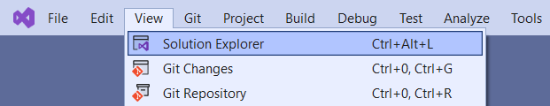

2. Знайдіть у вкладці Solution Explorer проєкти "HelloWorld" та "HelloWorld.Tests".

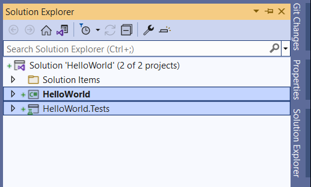

3. Розгорніть проєкт HelloWorld і знайдіть у проекті файл [SimpleHelloWorld.cs](HelloWorld/SimpleHelloWorld.cs). Відкрийте файл у редакторі.

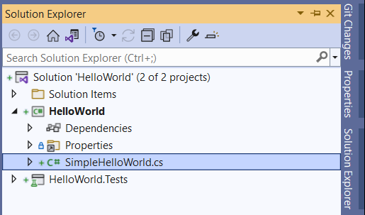

4. Відкрийте проєкт "HelloWorld.Tests" і знайдіть у проєкті файл [SimpleHelloWorldTests.cs](HelloWorld.Tests/SimpleHelloWorldTests.cs). Відкрийте файл у редакторі.

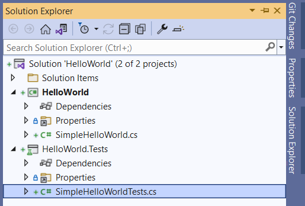

5. [Зберіть рішення](https://docs.microsoft.com/ru-ua/visualstudio/ide/building-and-cleaning-projects-and-solutions-in-visual-studio).
     * Виберіть елемент меню - _Build\Build Solution_.
     * Або використовуйте клавіші - _Ctrl+Shift+B_.

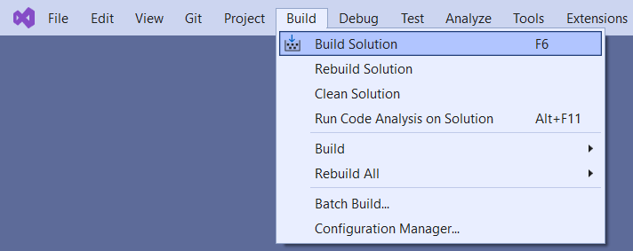

6. Перейдіть на вкладку [Error List](https://docs.microsoft.com/ru-ru/visualstudio/ide/find-and-fix-code-errors#review-the-error-list).
     * Виберіть елемент меню - _View\Error List_.
     * Або використовуйте сполучення клавіш - _Ctrl+\\, E_.

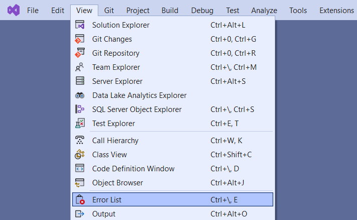

Переконайтеся, що у вкладці немає проблем (помилок або попереджень), які виявив компілятор C#.

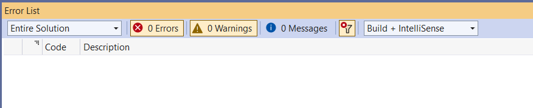

7. Перейдіть на вкладку [Test Explorer](https://docs.microsoft.com/ru-ru/visualstudio/test/run-unit-tests-with-test-explorer).
     * Виберіть елемент меню - _Tests\Test Explorer_.
     * Або використовуйте сполучення клавіш - _Ctrl+E, T_.

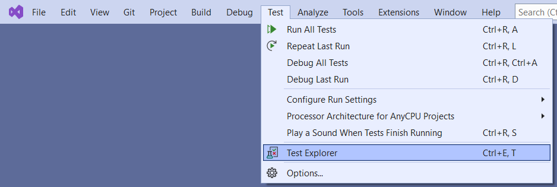

Всі тести у списку тестів мають блакитну іконку зі знаком оклику. Це означає, що тести були запущені.

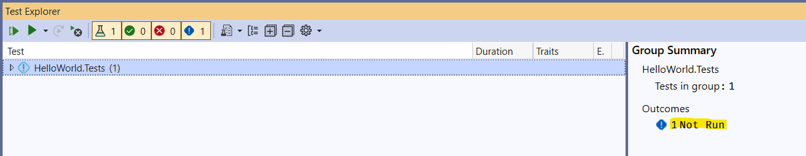

8. Виберіть елемент "HelloWorld.Tests" у списку тестів, натисніть на ньому правою кнопкою миші та виберіть у меню "Run".
     * Або використовуйте сполучення клавіш - _Ctrl+R, T_.

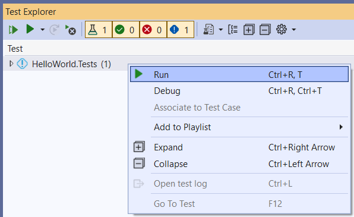

Усі елементи у списку стануть "зеленими".

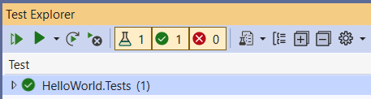

9. Розгорніть список, якщо потрібно. Натисніть правою кнопкою миші по тесту "ReturnHelloWorld" та виберіть у меню "Run". Вибраний елемент залишиться "зеленим".
     * Або використовуйте комбінацію клавіш - _Ctrl+R, T_.

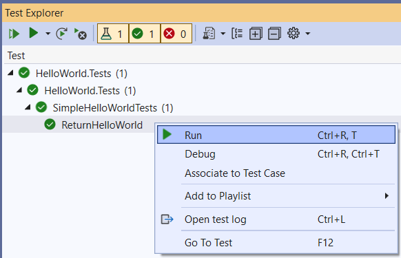

10. Запустіть усі юніт-тести.
     * Виберіть елемент меню - _Test\Run All Tests_.
     * Або використовуйте сполучення клавіш - _Ctrl+R, A_.

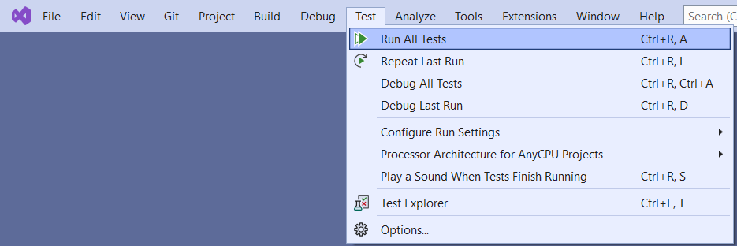

## Додаткова інформація

* Visual Studio
   * [Getting Started with Visual Studio 2019](https://www.youtube.com/watch?v=1CgsMtUmVgs)
   * [Default keyboard shortcuts in Visual Studio](https://docs.microsoft.com/ru-ru/visualstudio/ide/default-keyboard-shortcuts-in-visual-studio)
