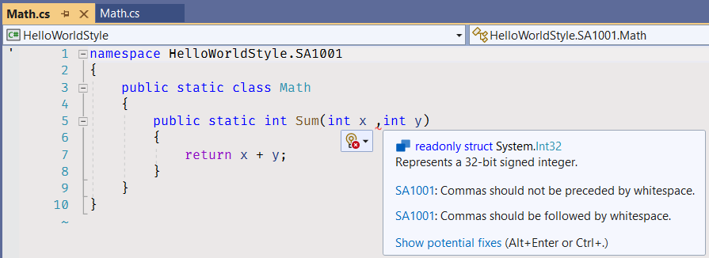
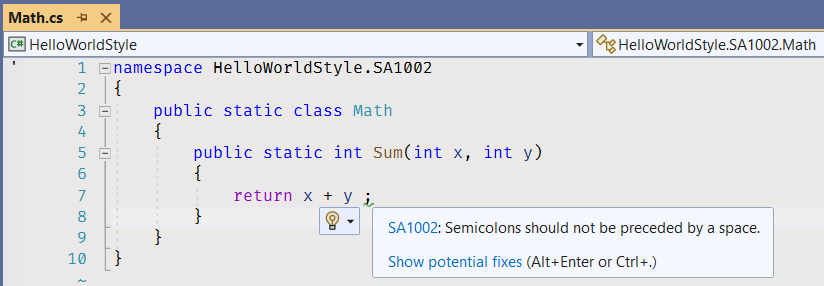
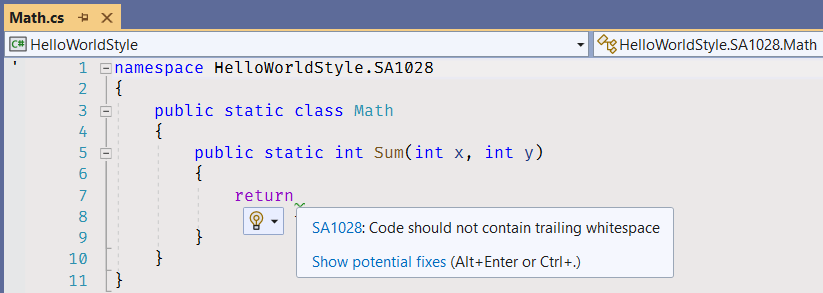
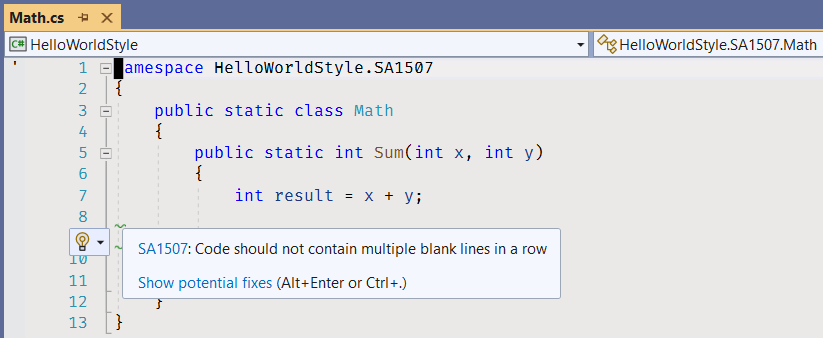
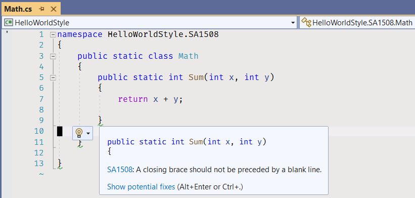
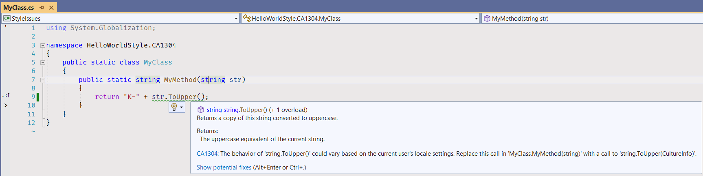

# Виправлення стилістичних помилок

Завдання початкового рівня для практики навички пошуку та виправлення стилістичних помилок, виявлених інструментами аналізу коду.

Переклади: [Англійська](README.md).

Час виконання завдання - 1г.

Для будування проєктів потрібен встановлений .NET 6 SDK.


## Опис завдання

### Зауваження StyleCop

[StyleCop Analyzers](https://github.com/DotNetAnalyzers/StyleCopAnalyzers) – це інструмент статичного аналізу коду, який використовується для пошуку в коді стилістичних помилок. StyleCop має [файл налаштувань](code-analysis.ruleset), в якому знаходиться список включених правил; інструмент генерує помилку або попередження, якщо правило порушується. Документацію правил та роз'яснення умов застосування правил можна знайти в [розділі документації StyleCop](https://github.com/DotNetAnalyzers/StyleCopAnalyzers/blob/master/DOCUMENTATION.md).


### SA1001

1. [Зберіть рішення](https://docs.microsoft.com/en-us/visualstudio/ide/building-and-cleaning-projects-and-solutions-in-visual-studio).
     * Натисніть на пункт меню - _Build\Build Solution_.
     * або використайте поєднання клавіш за замовчуванням - _Ctrl+Shift+B_ (в різних версіях Visual Studio можуть бути різні поєднання клавіш. Дивіться статтю [Keyboard shortcuts in Visual Studio](https://docs.microsoft.com/en-us/visualstudio/ide/default-keyboard-shortcuts-in-visual-studio)).


2. Відкрийте вікно [Error List](https://docs.microsoft.com/en-us/visualstudio/ide/find-and-fix-code-errors#review-the-error-list).
     * Натисніть на пункт меню - _View\Error List_.
     * або використайте поєднання клавіш за замовчуванням - _Ctrl+\\, E_.


3. Знайдіть помилку з кодом SA1001 і дізнайтесь деталі клікнувши по посиланню в колонці "Code".


Ви будете направлені до сторінки з документацією.

4. Клікніть двічі по рядку SA1001, що міститься в вікні Error List.


Ви повинні перейти до файлу [SA1001/Math.cs](StyleIssues/SA1001/Math.cs).



5. Прочитайте на сторінці з документацією [як виправити помилку](https://github.com/DotNetAnalyzers/StyleCopAnalyzers/blob/master/documentation/SA1001.md#how-to-fix-violations): "Щоб виправити помилку, переконайтеся, що після коми стоїть один пробіл, а перед нею не стоїть пробіл."

6. Стріть пробіл перед комою в списку параметрів методу.

```cs
public static int Sum(int x, int y)
````

7. Додайте пробіл після коми.

```cs
public static int Sum(int x, int y)
````

8. Перебудуйте рішення.


9. Відкрийте вікно _Error List_ знову і переконайтеся що помилки SA1001 немає.


### SA1002



1. Відкрийте вікно _Error List_, знайдіть помилку SA1002.
1. Відкрийте і прочитайте сторінку з документацією про помилку.
1. Перейдіть до коду клікнувши по стрічці з помилкою в вікні _Error List_.
1. Видаліть пробіл перед крапкою з комою.
1. Перебудуйте рішення.
1. Відкрийте вікно _Error List_ знову і переконайтеся що помилки SA1002 більше немає.


### SA1005


Виправте помилку видаленням неправильної стрічки коду та розкоментуванням закоментованого коду.


### SA1008


Виправте помилку видаленням пробілів перед і після відкритої круглої дужки.


### SA1025


Виправте помилку видаленням лишніх пробілів.


### SA1028



Виправте помилку видаленням лишніх пробілів в кінцях стрічок.


### SA1500


Виправте помилку переставленням відкритих та закритих хвилястих дужок на нові стрічки.


### SA1505


Виправте помилку видаленням пустих стрічок після відкритої хвилястої дужки.


### SA1507



Виправте помилку видаленням лишніх пустих стрічок.


### SA1508



Виправте помилку видаленням пустих стрічок перед закритими хвилястими дужками.

Ви можете пройти до порталу AutoCode, відкрити сторінку завдання і почати перевірку завдання.


## Roslyn Analyzers

[Аналізатори платформи компілятора .NET](https://docs.microsoft.com/en-us/dotnet/fundamentals/code-analysis/overview) перевіряють ваш код C# на наявність проблем із якістю та стилем коду. Починаючи з .NET 5, ці аналізатори включаються з .NET SDK. Якщо ваш проєкт націлений на .NET 5 чи новішу версію, аналіз коду ввімкнено за замовчуванням.


### CA1304



Виправте помилку доданням параметру _InvariantCulture_ до виклику методу _ToUpper_.

```cs
public static string MyMethod(string str)
{
     return "K-" + str.ToUpper(CultureInfo.InvariantCulture);
}
````


### CA1305


Виправте помилку доданням параметру _InvariantCulture_ до виклику методу _ToUpper_.

```cs
public static string MyMethod(int i)
{
     return "X" + i.ToString(CultureInfo.InvariantCulture);
}
````


### CA1507


Виправте помилку використанням [виразу nameof](https://docs.microsoft.com/en-us/dotnet/csharp/language-reference/operators/nameof), як параметра конструктора винятку.

```cs
public static string MyMethod(string str)
{
     if (str == null)
     {
         throw new ArgumentNullException(nameof(str));
     }

     return "test" + str;
}
````


### CA1707 & SA1300


Виправте помилку видаленням нижньої риски з назви методу. Використовуйте [стандарти використання великих літер в C#](https://docs.microsoft.com/en-us/dotnet/standard/design-guidelines/capitalization-conventions): _Pascal Casing_ для назв методів і _Camel Casing_ для назв параметрів.

```cs
public static string MyMethod(string myStr)
{
     return myStr;
}
````


## Виправте зауваження компілятора

Додаткові перевірки стилю та коду ввімкнено для проєктів у цьому рішенні, щоб допомогти вам підтримувати узгодженість вихідного коду проєкту та уникати безглуздих помилок. [Перегляньте список помилок](https://docs.microsoft.com/ru-ru/visualstudio/ide/find-and-fix-code-errors#review-the-error-List) у Visual Studio, щоб побачити всі попередження та помилки компілятора.

Якщо повідомлення про помилку або попередження компілятора поставило Вас у глухий кут, [відкрийте сторінку документації помилки або попередження](https://docs.microsoft.com/ru-ua/visualstudio/ide/find-and-fix-code-errors#review-errors-in-detail) або загугліть код помилки в пошуковій системі.

Також ви можете використовувати [базу знань правил Sonar](https://rules.sonarsource.com/csharp) для пошуку додаткової інформації про помилки, які виникли на етапі перевірки завдання аналізатором Sonar.


## Чекліст завдання

1. Зберіть рішення.
2. Виправте всі помилки та попередження компілятора. Переконайтеся, що у вікні _Error List_ немає помилок та попереджень компілятора.


3. Запустіть всі юніт тести. Переконайтеся, що всі вони пройдені успішно.


4. Перегляньте всі зміни. Переконайтеся, що зміни зроблені лише у файлах із кодом (.cs), які знаходяться у проєкті StyleIssues.


Змін у файлах проєкту (.csproj) та у файлах з кодів у проєкті StyleIssues.Tests не повинно бути.


5. Зафіксуйте зміни.


Усі ваші зміни зафіксовано.


6. Створіть коміт та помістіть ваші зміни у віддалений репозиторій.


## Додаткова інформація

* Visual Studio
   * [Початок роботи з Visual Studio 2019](https://www.youtube.com/watch?v=1CgsMtUmVgs)
   * [Поєднання клавіш за замовчуванням у Visual Studio](https://docs.microsoft.com/en-us/visualstudio/ide/default-keyboard-shortcuts-in-visual-studio)